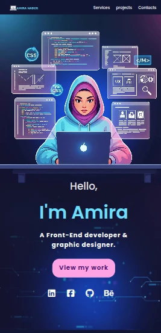
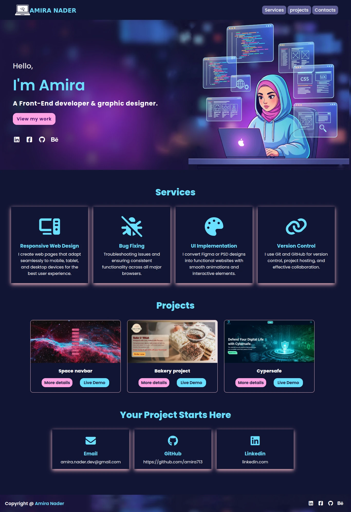

## العربي 🇪🇬 

# 👩‍💻 بورتفوليو شخصي – Amira Nader

ده تالت مشروع ليا في تعلم تطوير الويب.  
المشروع عبارة عن موقع بورتفوليو شخصي بيعرض المعلومات عني، شغلي، والمشاريع اللي بعملها.  
اتعلمت خطوات المشروع من قناة 
Codezilla على يوتيوب، وده رابط المشروع الأصلي:  
[مشروع Codezilla](https://www.youtube.com/watch?v=cARGOrtiWt4&list=PLuXY3ddo_8nwyBVa1I3xHXYgpQHJ1Z0wn&index=2)

---

## 🚀 العرض المباشر (Live Demo)
[اضغط هنا لعرض المشروع](https://amira713.github.io/my-portfolio/)

---

## 📱 صور من المشروع (Screenshots)

### نسخة الموبايل
**عرض الموبايل**  

### نسخة سطح المكتب
**عرض الكمبيوتر**  

---

## 🛠️ الأدوات المستخدمة
- HTML5  
- CSS3 (Flexbox & Media Queries)  

---

## 📚 ماذا تعلمت
- بناء موقع بورتفوليو شخصي من الصفر.  
- تنسيق العناصر باستخدام Flexbox.  
- عمل تصميم متجاوب باستخدام Media Queries.  
- رفع المشروع على GitHub وعرضه كـ Live Demo.  

---

## 🙌 الشكر
كل الشكر لقناة
 **Codezilla**
  على الشرح والمشروع التعليمي.

  ## English 🌍

  # 👩‍💻 Personal Portfolio – Amira Nader

This is my **third project** in web development.  
It’s a **personal portfolio website** to showcase my information, work, and projects.  
I learned the steps from **Codezilla’s YouTube channel**, and here’s the original project:  
[Codezilla Project](https://www.youtube.com/watch?v=cARGOrtiWt4&list=PLuXY3ddo_8nwyBVa1I3xHXYgpQHJ1Z0wn&index=2)

---

## 🚀 Live Demo
[Click here to view the project](https://amira713.github.io/my-portfolio/)

---

## 📱 Screenshots

### Mobile Version

### Desktop Version

---

## 🛠️ Built With
- HTML5  
- CSS3 (Flexbox & Media Queries)  

---

## 📚 What I Learned
- Building a personal portfolio website from scratch.  
- Styling layouts using Flexbox.  
- Making the design responsive with Media Queries.  
- Deploying the project on GitHub and showcasing it with a Live Demo.  

---

## 🙌 Credits
Special thanks to **Codezilla** for the tutorial and project idea.

